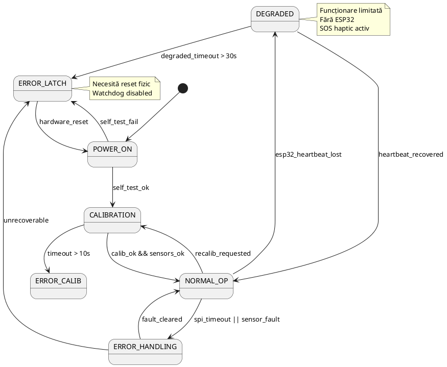
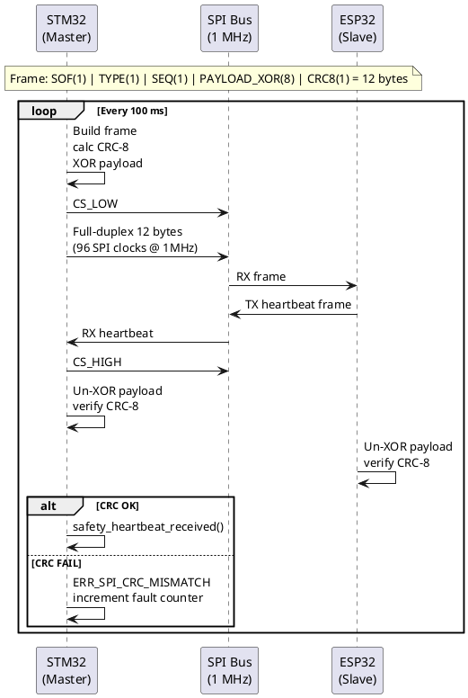

# Faza 11 — Documentație Tehnică Obligatorie (Licență)

**Status:** 🔜 PLANIFICATĂ  
**Dependințe:** Faza 5 completă (pentru FMEA), Faza 9 (pentru traceabilitate)  
**Locație:** `docs/deliverables/`

---

## Livrabile

### 11.1 Schema Electrică (Hardware Schematic)

**Tool:** KiCad 8.x  
**Fișier:** `docs/deliverables/schematic/gloveassist_schematic.pdf`

Elemente obligatorii:
- Divizoarele de tensiune 47kΩ pentru senzori flex (3V3 → ADC)
- Circuit de protecție motor: tranzistor 2N2222 + diodă flyback 1N4148
- Circuit buzzer: tranzistor BC547 + rezistor 100Ω bază
- Bypass capacitors pe LDO (100nF + 10µF)
- Conector SPI 5-pin STM32↔ESP32 (VCC, GND, SCK, MOSI/MISO, CS)
- Protecție ESD pe linii SPI (TVS 5V)

---

### 11.2 FSM (Finite State Machine)

**Format:** PlantUML → PNG  
**Fișier:** `docs/deliverables/diagrams/fsm_main.puml`

---

### 11.3 Diagrama de Secvență SPI

**Format:** PlantUML → PNG  
**Fișier:** `docs/deliverables/diagrams/sequence_spi.puml`

---

### 11.4 Matrice de Trasabilitate

**Format:** Markdown table  
**Fișier:** `docs/deliverables/traceability_matrix.md`

| ID Cerință | Descriere | Fișier Implementare | Funcție/Macro | Test Ztest |
|-----------|-----------|---------------------|---------------|-----------|
| FR-001 | Citire 4 senzori flex | `sensor_logic.c` | `sensor_read_all()` | `test_range_check` |
| FR-002 | Filtru IIR 8 eșantioane | `sensor_logic.c` | `apply_iir_filter()` | `test_iir_convergence` |
| FR-003 | Detecție gest FIST | `sensor_logic.c` | `classify_gesture()` | `test_gesture_fist` |
| FR-004 | Detecție gest HELP | `sensor_logic.c` | `classify_gesture()` | `test_gesture_help` |
| FR-005 | Watchdog IWDG 2s | `safety_diag.c` | `safety_init()` | N/A (hardware) |
| FR-006 | Heartbeat monitor 2s | `safety_diag.c` | `safety_thread_entry()` | `test_heartbeat_timeout` |
| FR-007 | CRC-8/CCITT pe SPI | `spi_protocol.c` | `crc8_ccitt()` | `test_crc8_vector` |
| FR-008 | XOR obfuscare payload | `spi_protocol.c` | `spi_frame_build()` | `test_xor_roundtrip` |
| FR-009 | BLE NUS advertising | `comms_ble.c` | `ble_init()` | N/A (hardware) |
| FR-010 | MQTT over TLS 1.2 | `mqtt_task.c` | `mqtt_connect_tls()` | N/A (integration) |
| FR-011 | OLED display gest | `haptic_ui.c` | `display_gesture()` | N/A (visual) |
| FR-012 | SEQ counter anti-replay | `spi_protocol.c` | `spi_frame_build()` | `test_replay_detect` |
| FR-013 | Range check ADC | `sensor_logic.c` | `sensor_check_range()` | `test_range_below_min` |
| FR-014 | Fallback interpolare | `sensor_logic.c` | `apply_fallback()` | `test_fallback_middle` |

---

### 11.5 FMEA (Failure Mode and Effects Analysis)

**Format:** Markdown table  
**Fișier:** `docs/deliverables/fmea.md`

| ID | Componentă | Mod de Defect | Efect | Severitate | Probabilitate | RPN | Mecanism de Detecție | Acțiune de Recuperare |
|----|-----------|--------------|-------|-----------|--------------|-----|---------------------|----------------------|
| F01 | Senzor flex (1 deget) | Fir rupt (open circuit) | ADC < 614 | 3 | 2 | 6 | Range check ADC | Interpolare din vecini |
| F02 | Senzor flex (≥2 degete) | Multiplu open | Gest invalid | 4 | 1 | 4 | Range check + fault counter | ERROR_LATCH + SOS |
| F03 | SPI bus | Interferență electromagn. | CRC mismatch | 3 | 2 | 6 | CRC-8 validation | Discard + retry |
| F04 | ESP32 | Blocare software | Heartbeat pierdut | 4 | 1 | 4 | Timeout 2s | Degraded mode + alarm |
| F05 | STM32 | Blocare software | Watchdog reset | 5 | 1 | 5 | IWDG hardware | Safe reset + reinit |
| F06 | Alimentare | Cădere tensiune | Sistem oprit | 5 | 2 | 10 | LWT MQTT | — (notificare medic) |
| F07 | Motor vibrație | Scurtcircuit bobinaj | GPIO STM32 deteriorat | 4 | 1 | 4 | Tranzistor 2N2222 | Transistor protejează GPIO |
| F08 | BLE | Deconectare | Date pierdute la medic | 3 | 3 | 9 | Callback `disconnected` | Buffer + LWT |

---

## Plan de lucru

1. Schemă electrică în KiCad
2. Export diagrame PlantUML → PNG
3. Completare matrice trasabilitate după Faza 9
4. Completare FMEA cu RPN calculat
5. Revizuire de un profesor sau inginer de siguranță

---

## Criterii de Acceptare

- [ ] Schema electrică completă cu toate componentele
- [ ] FSM diagram acoperă toate tranzitiiile posibile
- [ ] Diagramă secvență SPI cu timing corect
- [ ] Matrice trasabilitate: fiecare cerință are cel puțin un test
- [ ] FMEA: toate componentele hardware documentate
